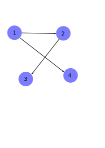
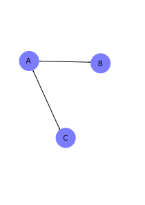

# Introduction mathématiques aux graphes

Pour une introduction en anglais très visuel aux graphes suivez [ce lien](https://d3gt.com/unit.html).

## Définition: Graphe Orienté

Un graphe est un couple d'ensembles
$$(V, E)$$
tels que
$$E \subset V^2$$

- $V$ vient de **vertices** (ou aussi **nodes**), en français on parle des **sommets** ou des **noeuds** du graphe.
- $E$ vient **edges**, en français on parle des arrêtes.
- Une arrête est donc juste un grouple de sommets.

Exemple:
$$G = (\{1, 2, 3, 4\}, \{(1, 2), (2, 3), (1, 4)\}).$$

## Définition: Chemin

Etant donné un graphe $G=(S, A)$, on appelle chemin la donnée d'un entier $n\geq 1$ et de $(e_0,...e_n) \in S^{n+1}$ une suite de sommets telle que
$$\forall i \in \{1,...,n\},\qquad (e_{i-1}, e_i) \in A.$$
On appelle $n$ la longueur du chemin.

**Exemple**:
Pour le graphe ci-dessus
- $(1, 2, 3)$ est un chemin de longueur 2
- $(1, 4)$ est un chemin de longueur 1
- $(1, 2, 4)$ n'est pas un chemin car $(2, 4)\notin A$

**Remarque**: on peut très bien avoir une arrête reliant un état à lui même!

## Définition: Graphe non orienté

Soit $G=(S, A)$ un graphe orienté, on dira que $G$ est non orienté lorsque
$$\forall (x,y)\in S^2,\qquad (x,y)\in A \Rightarrow (y, x) \in A.$$

**Exemple**:
$$G= (\{A, B, C\}, \{(A,B), (B,A), (A, C), (C, A)\})$$

## Définition: Voisinage

Soit $G=(S, A)$ un graphe, soit $s\in S$ un sommet. On appelle voisinage de $s$ l'ensemble
$$\mathrm{Vois}(s):=\{e\in S\ : \ (s,e)\in A\}.$$

**Exemples**:
Pour le graphe
$$G = (\{1, 2, 3, 4\}, \{(1, 2), (2, 3), (1, 4)\}).$$
On a
- $\mathrm{Vois}(1) = \{2, 4\}$
- $\mathrm{Vois}(2) = \{3\}$
- $\mathrm{Vois}(3) = \{\}$
- $\mathrm{Vois}(4) = \{\}$
