# Graphes pondérés

## Définitions

- Un graphe $(S, A)$ est dit pondéré lorsqu'on a une fonction $\pi:A \to \mathbb{R}$.
- On dit qu'il est pondéré positivement si la fonction $\pi$ est à valeurs positives.
- Si on a un graphe pondéré positivement on introduit la distance $d$ sur $S^2$ par
$$
\forall (S_1, S_2)\in S^2,\quad d(S_1, S_2):= \underset{(x_0,x_1,...,x_n)\in S^{n+1}}{\min}\sum_{i=1}^n \pi((x_{i-1}, x_i)) \quad \text{ avec } 
\begin{cases}
x_0=S_1\\
x_n=S_2\\
\forall i \in \{1,...,n\},\quad (x_{i-1}, x_i) \in A
\end{cases}
$$
**REMARQUE** si il n'y a pas de chemin reliant les deux sommets, la distance est $+\infty$
- Un graphe pondéré sera dit non orienté si les arrêtes symétriques ont même poids.
## Calcul

**QUESTION** comment calculer efficacement la distance entre deux sommets. Et si possible trouver un chemin de longueur minimale?

**EXERCICE** 15min -> 10h50\
Trouver la distance entre $A$ et $I$ dans le graphe ci-dessous.

**REMARQUE** 
- $AEI$ a le moins d'arrêtes mais un poids 11, mais $AEGI$ est de poids 10 même si il a plus d'arrêtes!
- un chemin reliant $A$ et $I$ passe forcément par $E$ et/ou $G$.
- Comme le graphe est positif, les boucles sont contre productive, on regarde donc les chemins sans boucles qui sont en nombre finis donc il y a un chemin de longueur minimale!
- Un chemin minimale de $A$ à $I$ est en fait minimal pour tous les sommets intermédiaires!
- En fait pour trouver la distance de $A$ à $I$ il faut en fait calculer la distante entre $A$ et chaque sommet!

## Algorithme de Dijsktra

|||
|---|---|
|A|0|
|B||
|C||
|D||
|E||
|F||
|G||
|H||
|I||

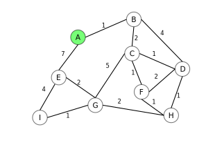

|||A|
|---|---|---|
|A|0|0|
|B||1|
|C|||
|D|||
|E||7|
|F|||
|G|||
|H|||
|I|||

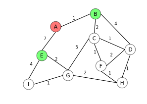

|||A|B|
|---|---|---|---|
|A|0|0||
|B||1|1|
|C|||3|
|D|||5|
|E||7|7|
|F||||
|G||||
|H||||
|I||||

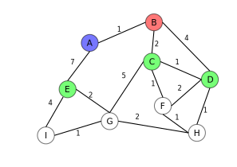

|||A|B|C|
|---|---|---|---|---|
|A|0|0|||
|B||1|1||
|C|||3|3|
|D|||5|4|
|E||7|7|7|
|F||||4|
|G||||8|
|H|||||
|I|||||

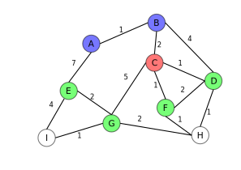

|||A|B|C|D|
|---|---|---|---|---|---|
|A|0|0||||
|B||1|1|||
|C|||3|3||
|D|||5|4|4|
|E||7|7|7|7|
|F||||4|4|
|G||||8|8|
|H|||||5|
|I||||||

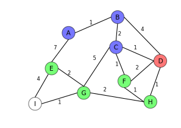

|   |   | A | B | C | D | F |
|---|---|---|---|---|---|---|
| A | 0 | 0 |   |   |   |   |
| B |   | 1 | 1 |   |   |   |
| C |   |   | 3 | 3 |   |   |
| D |   |   | 5 | 4 | 4 |   |
| E |   | 7 | 7 | 7 | 7 | 7 |
| F |   |   |   | 4 | 4 | 4 |
| G |   |   |   | 8 | 8 | 8 |
| H |   |   |   |   | 5 | 5 |
| I |   |   |   |   |   |   |

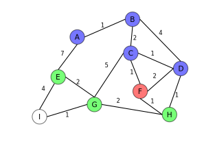

|   |   | A | B | C | D | F | H |
|---|---|---|---|---|---|---|---|
| A | 0 | 0 |   |   |   |   |   |
| B |   | 1 | 1 |   |   |   |   |
| C |   |   | 3 | 3 |   |   |   |
| D |   |   | 5 | 4 | 4 |   |   |
| E |   | 7 | 7 | 7 | 7 | 7 | 7 |
| F |   |   |   | 4 | 4 | 4 |   |
| G |   |   |   | 8 | 8 | 8 | 7 |
| H |   |   |   |   | 5 | 5 | 5 |
| I |   |   |   |   |   |   |   |

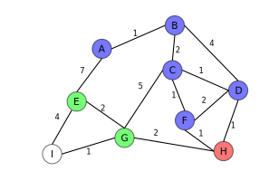

|   |   | A | B | C | D | F | H | E |
|---|---|---|---|---|---|---|---|---|
| A | 0 | 0 |   |   |   |   |   |   |
| B |   | 1 | 1 |   |   |   |   |   |
| C |   |   | 3 | 3 |   |   |   |   |
| D |   |   | 5 | 4 | 4 |   |   |   |
| E |   | 7 | 7 | 7 | 7 | 7 | 7 | 7 |
| F |   |   |   | 4 | 4 | 4 |   |   |
| G |   |   |   | 8 | 8 | 8 | 7 | 7 |
| H |   |   |   |   | 5 | 5 | 5 |   |
| I |   |   |   |   |   |   |   | 11|

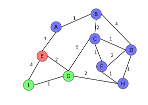

|   |   | A | B | C | D | F | H | E | G |
|---|---|---|---|---|---|---|---|---|---|
| A | 0 | 0 |   |   |   |   |   |   |   |
| B |   | 1 | 1 |   |   |   |   |   |   |
| C |   |   | 3 | 3 |   |   |   |   |   |
| D |   |   | 5 | 4 | 4 |   |   |   |   |
| E |   | 7 | 7 | 7 | 7 | 7 | 7 | 7 |   |
| F |   |   |   | 4 | 4 | 4 |   |   |   |
| G |   |   |   | 8 | 8 | 8 | 7 | 7 | 7 |
| H |   |   |   |   | 5 | 5 | 5 |   |   |
| I |   |   |   |   |   |   |   | 11| 8 |

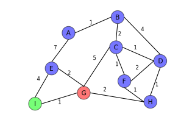

|   |   | A | B | C | D | F | H | E | G | I |
|---|---|---|---|---|---|---|---|---|---|---|
| A | 0 | 0 |   |   |   |   |   |   |   |   |
| B |   | 1 | 1 |   |   |   |   |   |   |   |
| C |   |   | 3 | 3 |   |   |   |   |   |   |
| D |   |   | 5 | 4 | 4 |   |   |   |   |   |
| E |   | 7 | 7 | 7 | 7 | 7 | 7 | 7 |   |   |
| F |   |   |   | 4 | 4 | 4 |   |   |   |   |
| G |   |   |   | 8 | 8 | 8 | 7 | 7 | 7 |   |
| H |   |   |   |   | 5 | 5 | 5 |   |   |   |
| I |   |   |   |   |   |   |   | 11| 8 | 8 |

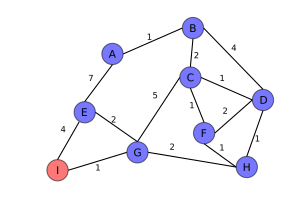

|   |   | A | B | C | D | F | H | E | G | I |
|---|---|---|---|---|---|---|---|---|---|---|
| A | 0 | 0 |   |   |   |   |   |   |   |   |
| B |   | 1 | 1 |   |   |   |   |   |   |   |
| C |   |   | 3 | 3 |   |   |   |   |   |   |
| D |   |   | 5 | 4 | 4 |   |   |   |   |   |
| E |   | 7 | 7 | 7 | 7 | 7 | 7 | 7 |   |   |
| F |   |   |   | 4 | 4 | 4 |   |   |   |   |
| G |   |   |   | 8 | 8 | 8 | 7 | 7 | 7 |   |
| H |   |   |   |   | 5 | 5 | 5 |   |   |   |
| I |   |   |   |   |   |   |   | 11| 8 | 8 |

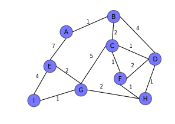
